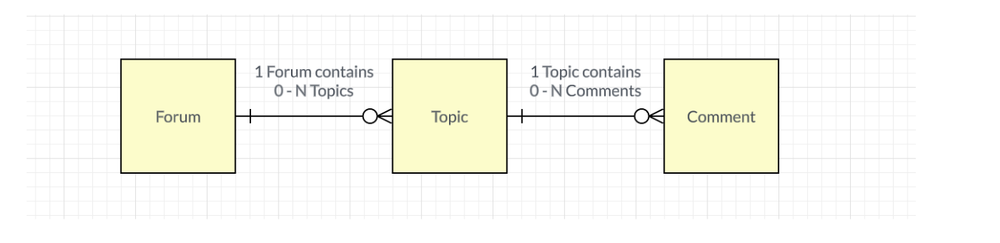
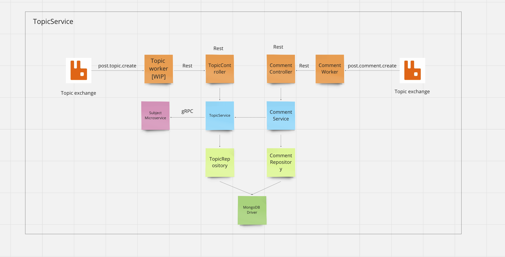

# Topic service

## Welcome to topic service

This service is all about topic. There are 3 important domain vocabs.

1. Forum -> The forum is the place that store related topics.
2. Topic -> The discussion of a specific issue anyone can open the topic.
3. Comment -> In each discussion, users who want to discuss about the specific topic can give comments.

Service Responsibility

1. A user can create topic that relate to the forum.
2. A comment cannot created if the topic isn't exist.
3. Forum will be create after the topic is created and the topic cannot create if the subject isn't valid in subject service.
4. A user can see all of the comments in every topic.

## Relationship diagram between domain vocabs.



## Starting project

### Step 1: Run subject service

Go to this repository https://github.com/jKulrativid/CU-Overflow-Subject-Service and make sure that your update the code to latest version by using

```
git pull
```

### Step 2: Update code for topic service

Run this command before doing anything. Make sure that you are in main branch

```
git pull
```

### Step 3: Create docker network

```
make create_network
```

### Step 4: Run message broker

```
make start_message_broker
```

### Step 5: Add production credential in /main/resources folder

You need to create application-production.properties. Contact me I will provide this file for you.

### Step 6: Run topic service and build dockerfile

```
make start_backend
```

If you finish this step, you can run every endpoint except endpoint that support message broker [/publishEvent]

### Step 7: Run topic worker

Go to this repository https://github.com/Polapob/sw-arch-topic-worker

## Api documentation

Detail api documentation via swagger -> swagger path = TBD

## System architecture



## FAQ

TBD
